# 🎬Movie Log

대전 2반 이진석 X 유현수 SSAFY 6기 1학기 최종 프로젝트

[TOC]

## 🛠기술 스택

#### Front-End

#### Back-End

#### Version Control

#### Dev Tools

#### 배포

#### 사용 API

 

## 🎯서비스 목표 및 기획

### ❓기획 의도

	- 영화를 재밌게 봤지만 기록할 만한 공간이 없는게 아쉽다는 아이디어
	- 내가 본 영화에 대한 감상을 친구들과 공유할 수 있으면 좋겠다는 아이디어.
	- 단순하고 어렵지 않은 UI/UX의 영화 리뷰/추천 사이트가 있었으면 좋겠다는 아이디어.

### ❗ SNS를 기반으로 한 영화 리뷰 페이지를 만들자 (서비스 목표)

- 나의 프로필 페이지에 내가 본 영화들을 기록할 수 있다.
- 한줄평, 감상소감, 별점 정도의 간단한 입력만으로 기록할 수 있다.
- 관람일 순, 좋아요 많은 순, 별점 순 등 다양한 옵션별로 리뷰를 정렬할 수 있다.
- 친구들의 페이지를 방문할 수 있고, 친구들과 좋아요, 팔로우를 나눌 수 있다.
- 친구들이 좋아요를 누른 리뷰와 내가 좋아요를 누른 리뷰를 바탕으로 영화를 추천 받을 수 있다.

### 👨‍👩‍👧‍👦서비스 타겟

- 영화 리뷰를 자주 작성 하는 사용자.
- 친구들과 영화 리뷰를 공유하고 싶은 사용자.
- 내 친구들의 관심 영화를 한 눈에 확인하고 싶은 사용자.

### 🔨Mock-Up

#### 	메인페이지 및 상세페이지

.png)

#### 	영화 검색 및 리뷰 작성 페이지

.png)

#### 	개인 프로필 

.png)

## 📂Components (Vue.js)

.png?table=block&id=958bae51-9fac-40d6-90c3-9ba4a09c2d6f&spaceId=eb77fbf0-e649-4449-9932-4cd1f14ce420&width=2000&userId=&cache=v2)

## 📂ERD (django)

.jpg)

## ✔구현한 기능

### 💻🖥📱 ViewPort별 Responsive Page(반응형)로 구현

### 📈사용자 인증

#### 	회원가입 / 로그인

##### 		아이디 중복검사 기능

##### .gif)

##### 		아이디, 이름, 비밀번호 조건에 맞게 입력했는지 검증

##### .gif)

#### 	회원정보 수정

##### 		프로필 이미지 삽입, 수정기능

##### .gif)

##### 		프로필 페이지 공개/비공개 기능

##### .gif)

### 🖥프로필 페이지

#### 	나의 프로필 페이지

##### 		프로필 이미지, 아이디, 팔로잉, 팔로워 수 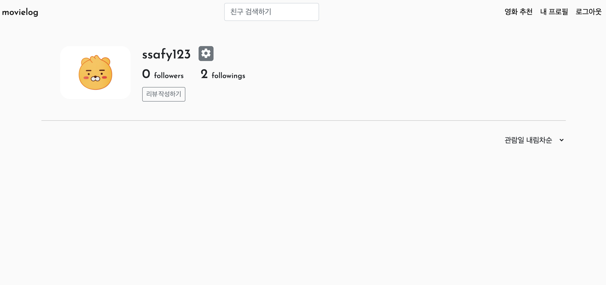

##### 		팔로잉, 팔로워 명단 확인 및 각 유저의 프로필 페이지로 이동 기능

##### 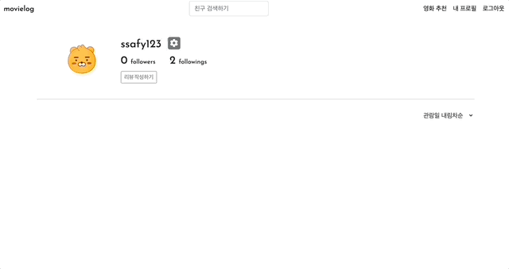

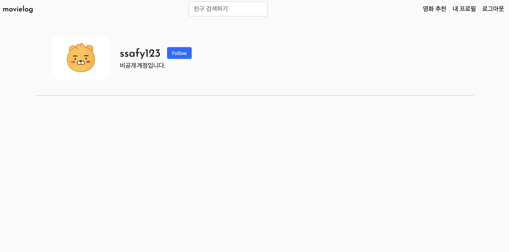

##### 		아이디 검색을 통한 사용자 검색 기능 및 사용자 추천 기능

##### .gif)

#### 	영화 리뷰 조회

##### 		프로필 페이지에 리뷰 정보 프리뷰

##### 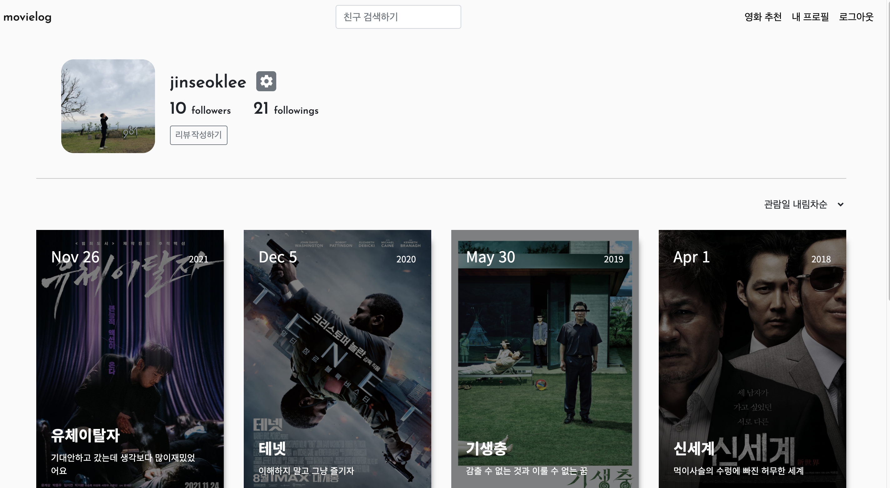

##### 		리뷰 정렬

##### 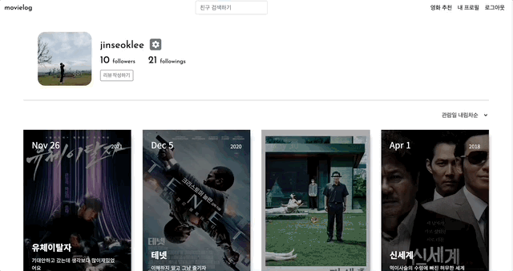

##### 		리뷰 상세 (조회, 수정, 삭제, 좋아요)

##### 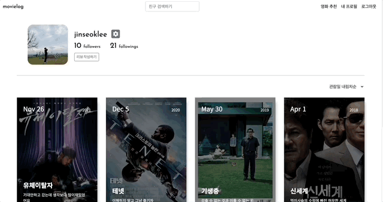

##### 		리뷰 댓글 (조회, 삭제, 좋아요)

##### 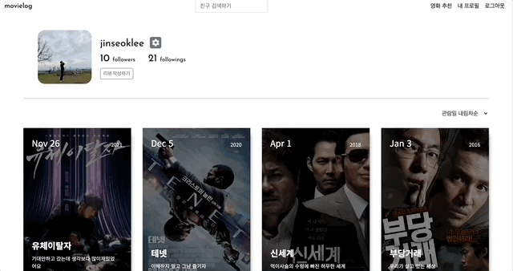

#### 	영화 리뷰 생성

##### 		입력한 검색어에 일치하는 영화 목록 조회 및 상세정보 조회

##### 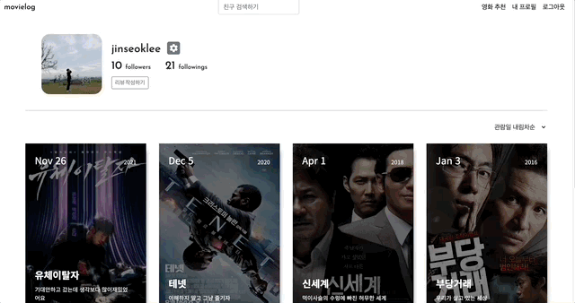

##### 		리뷰 생성

##### 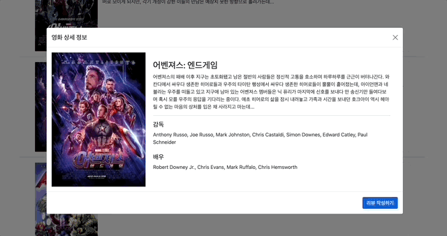

### 📽영화 추천 페이지

#### 	영화 추천

##### 		팔로우, 좋아요 DB에 기반한 영화 추천 및 상세정보

##### 

##### 		TMDB 인기도 상위 영화 추천 및 상세정보

##### 

## 👨‍👦팀원 소개 및 업무

|                             이름                             | 개발 내용                                                    |
| :----------------------------------------------------------: | ------------------------------------------------------------ |
| 이진석 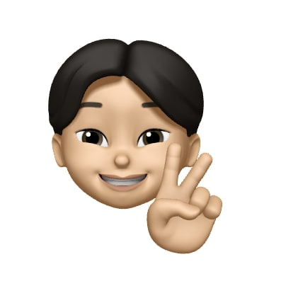 | profiles API 리뷰 목록, 댓글, 좋아요, 팔로우 컴포넌트 영화 추천 알고리즘 & 컴포넌트 README.md 작성 |
| 유현수  | accounts API accounts Vue 컴포넌트 마크업 및 스타일링 작업 UI/UX 디자인 발표 자료 제작 |

## 📅개발과정

[Dev Tasks(Notion)]: https://stream-lifter-a53.notion.site/movielog-PJT-e670135d981a4b01b778b0f40fa2efae	"Dev Tasks(Notion)"

[Notion Project Page](https://stream-lifter-a53.notion.site/movielog-PJT-e670135d981a4b01b778b0f40fa2efae)

### 애자일 프로세스 적용

> 1차, 2차, 3차 스프린트로 구분하여 프로젝트 진행

- 1차: ERD, 뷰 컴포넌트 구조 작성, 스켈레톤 코드 작성
- 2차: 세부 기능 추가 구현 및 버그 픽스
- 3차: 스타일 적용

### 칸반 보드 사용

- 칸반 보드를 사용하여 todo, issue, bug 티켓을 생성
- 담당자, Due date를 기록
- 각 티켓에 새로 알게 된 점, 문제 해결 방법 등을 기록
- 매일 작업 시작 전, 후로 스크럼

| 좋았던 점                                                    | 보완할 점                                                    |
| :----------------------------------------------------------- | :----------------------------------------------------------- |
| - 쉽고 명확한 작업 진행상황의 기록, 파악 - 커뮤니케이션 비용이 거의 들지 않았다고 생각한다. | - 현업처럼 각 티켓별로 1커밋을 해보고 싶었으나 컨플릭트 및 현실적인 이슈로 해보지 못 했다. |

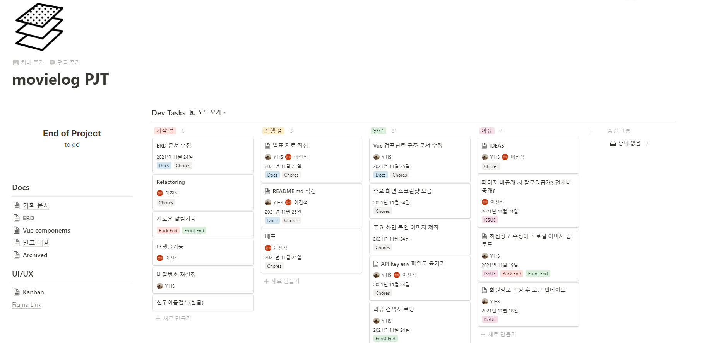

## ✏개발 후기

### 이진석

- 한 학기를 마무리하는 최종 프로젝트를 진행 하면서 느꼈던 것은 크게 기술 스택의 깊이 부족과 협업의 중요성 이었습니다. 여러가지를 배운만큼은 사용 할 수 있다고 생각했지만, 막상 개발하는 과정에서는 생각대로 되지 않는 것들이 많았습니다. 예를들면 서버 API를 구현하고 난 뒤에 client와의 통신에 관한 이슈가 발생하거나, 페이지가 이동해도 modal이 꺼지지 않는 이슈, swiper.js의 영역이 웹페이지를 초과하는 이슈, 서버에서 model을 짠 뒤에 개발 흐름에 따라가다 보니 명시적이지 못한 ERD구조, 생각대로 컨트롤 되지 않는 데이터베이스 등의 이슈가 있었습니다. 그래서 이번 프로젝트가 제출로 끝나지 않고 계속해서 버전업을 하면서 완성도 높은 사이트를 구현해 보고자 합니다. 

- 정말 좋은 팀원을 만나서 예상보다 좋은 결과물을 얻은 것 같습니다. 서로 피드백도 잘되고, 부족한 점도 서로 보완이 아주 잘 되는 좋은 케미였습니다. 이번 프로젝트를 통해서 좋은 팀원의 긍정적인 효과를 제대로 체감했다고 생각합니다. 저도 앞으로 좋은 팀원이 되기 위해 항상 노력하도록 하겠습니다.

### 유현수

#### 소감

- 좋은 팀원을 만나 시윈시원한 커뮤니케이션과 의사결정이 가능했습니다. 덕분에 기대 이상으로 좋은 결과물을 낼 수 있었다고 생각합니다. 진석이형에게 이 모든 영광을...
- 프로젝트가 끝나고부터 진짜 시작이라는 생각이 듭니다. 다 만들고 나서 보이는 비효율적인 구조나 방법을 개선하고 기록할 때 정말 많이 성장하지 않을까 싶습니다. 아래 Lesson Learned에 적어둔 내용을 하나하나 찾아보고 보완할 예정입니다.

#### Lesson Learned

##### Front End

- 모달을 사용하면서 하나의 컴포넌트에 어느 영역까지 담겨야 하는지 고민되는 순간이 많았습니다. 효율적인 컴포넌트 구조를 고민하고 리팩터링을 해보고 싶습니다.
- 컴포넌트마다 중복되는 메서드가 꽤 많았습니다. vuex를 사용하는만큼 전역에서 관리할 수 있는 메서드는 전역에서 관리되도록 리팩터링을 해보고 싶습니다.

- 부트스트랩 커스텀을 할 수 없어서 기본 부트스트랩 스타일링이 많이 적용되어 있습니다. CSS, SCSS로 반응형 스타일링을 직접 할 수 있도록 연습이 필요하다고 느꼈습니다.
- 프로젝트에 모달이 정말 많이 사용되었는데, 부트스트랩 모달의 작동 방식을 완전히 이해하지 못한 채로 사용하느라 많은 시행착오를 겪었습니다. 부트스트랩에 의존하지 않고 모달을 구현하고 커스텀하는 연습이 필요하다고 느꼈습니다.
- 브라우저의 뒤로가기 버튼을 누를 때 발생하는 버그가 많았습니다. 하지만 뒤로가기 이벤트는 감지할 수 없어서 꽤 어려움을 겪었습니다. 관련 버그를 해결할 수 있는 방법을 찾아보고 싶습니다.

##### Back End

- 일단 API를 구현하기 급급했던 것 같습니다. 현재 API에서 쿼리가 어떻게 날아가는지 확인하고 최적화하는 연습을 해보고 싶습니다.

##### 보안

- JWT 토큰을 사용하고 있지만 여전히 보안 취약점이 많다고 느꼈습니다. JWT 토큰의 갱신 및 재발급 등 보안 수준을 높이기 위한 방법을 연습해보고 싶습니다.

##### 배포

- 성공적인 배포를 위해서는 HTTPS & SSL 설정이 필요한 것 같습니다. 해당 부분을 조금 더 공부해서 배포까지 완료해보고 싶습니다.
